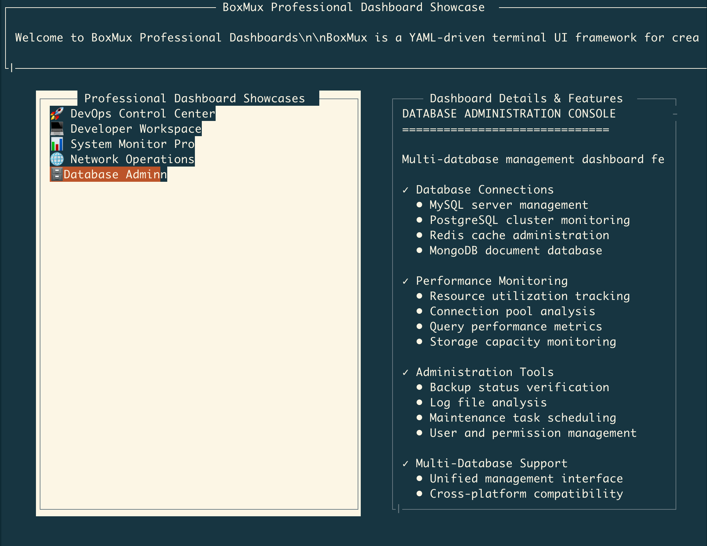
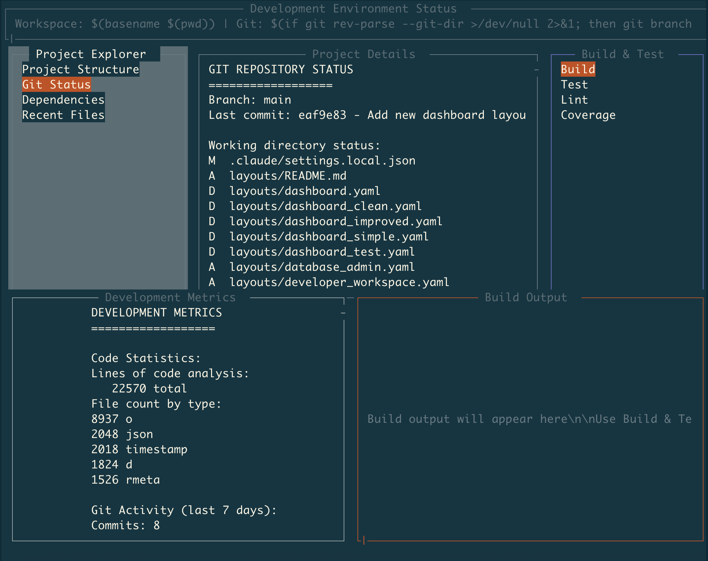
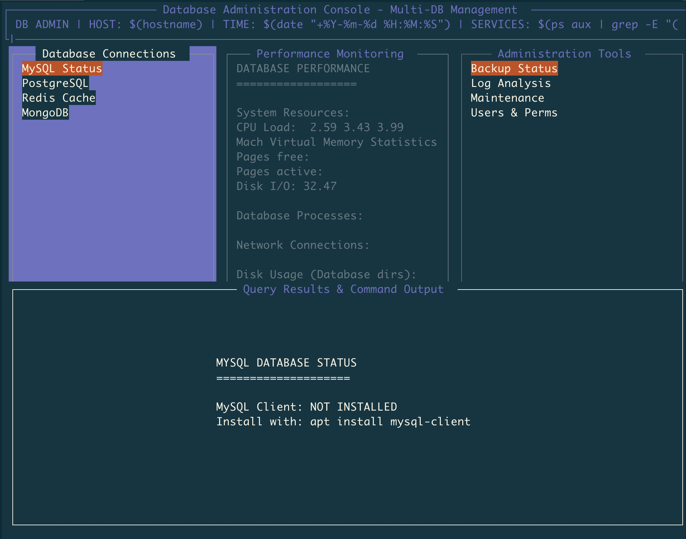
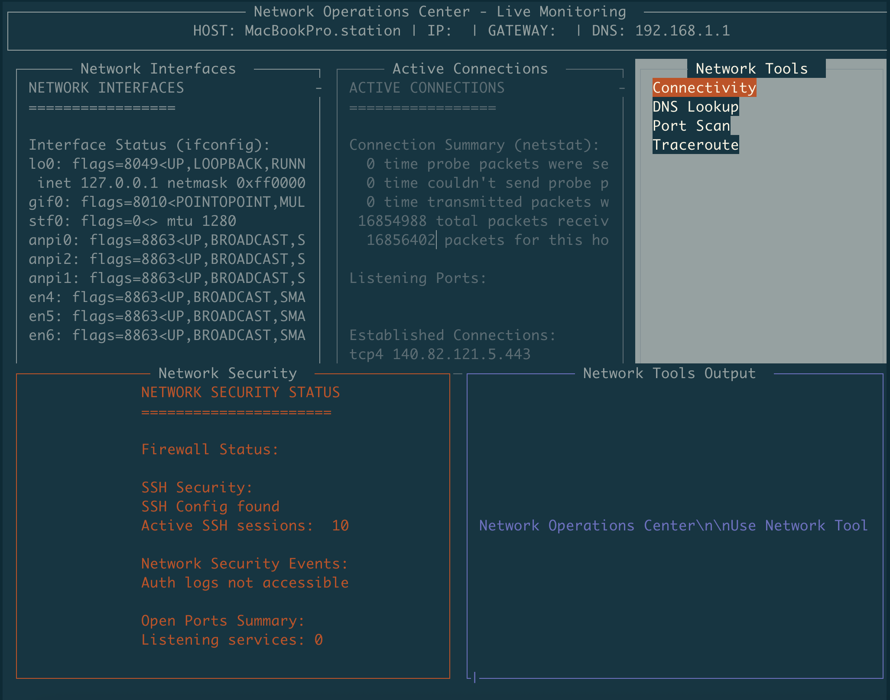

# BoxMux

**Automate tasks and put automation into terminal dashboards with minimal effort. Use YAML to transform Unix commands into interactive programs running in organized, threaded interfaces.**

[](https://opensource.org/licenses/MIT)
[](https://crates.io/crates/boxmux)
[](https://crates.io/crates/boxmux)
[](https://docs.rs/boxmux)


## What is BoxMux?

BoxMux lets you automate tasks and immediately visualize that automation in terminal interfaces. Define shell commands and scripts in YAML configuration to create monitoring dashboards, system administration tools, and interactive applications. Commands execute in separate threads with clean process management and real-time output display.

### Key Features

**Core Framework (Complete)**

- YAML Configuration Loading: Load app configuration from YAML files with validation
- Multi-Layout System: Support multiple layouts with root/active switching
- MuxBox Hierarchy: Nested box structure with parent-child relationships and bounds calculation
- Real-time Rendering: Efficient terminal rendering with frame rate control
- Multi-threaded Architecture: Thread manager coordinating multiple execution threads
- Input Handling: Full keyboard input processing and routing with custom key bindings
- Terminal Resize: Dynamic terminal resizing and layout recalculation
- Configuration Validation: JSON Schema validation with error reporting

**UI Components and Styling (Complete)**

- MuxBox Positioning: Flexible box positioning with percentage/absolute bounds
- Borders and Styling: MuxBox borders with customizable colors and 16 ANSI color palette
- Text Rendering: Multi-line text content display with wrapping and positioning
- Choice/Menu System: Interactive menu components with selection and navigation
- Focus Management: Tab order and focus navigation between boxes
- Error State Styling: Visual error indication with specialized colors
- Scrolling Support: Scrolling with position preservation, page navigation, visual indicators, and auto-scroll functionality

**Scripting and Automation**

- Script Execution: Execute shell scripts in boxes with output capture and error handling
- Threaded Execution: MuxBox scripts run in dedicated threads with refresh intervals
- Output Redirection: Redirect script output to different boxes (replace or append)
- Auto-Scroll to Bottom: Automatically scroll to bottom when new content arrives, ideal for logs
- Library Support: Include external script libraries for reusable functionality
- File Output: Save box content to files for persistence

**PTY (Pseudo-Terminal) Features**

- Interactive Terminal Emulation: Run interactive programs (vim, htop, less) in boxes
- PTY Process Management: Process lifecycle control with kill, restart, and status tracking
- ANSI Processing: Handle ANSI escape codes, colors, and cursor positioning
- PTY Error Recovery: Fallback to regular execution on PTY failures
- Circular Buffer Storage: Scrollback with 10,000-line default capacity
- PTY Input Routing: Send keyboard input to focused PTY boxes
- Special Key Handling: Arrow keys, function keys (F1-F24), and modifier combinations
- PTY Visual Indicators: Lightning bolt (⚡) title prefix and color-coded borders
- Socket PTY Control: PTY process management via socket commands

**Socket API and Remote Control (Complete)**

- Unix Socket Server: Manual Unix socket server implementation for remote control
- MuxBox Content Updates: Update box content via socket commands
- MuxBox Script Updates: Replace box scripts dynamically
- Layout Switching: Switch active layout via socket commands
- MuxBox Management: Add/remove boxes dynamically through API
- Refresh Control: Start/stop box refresh via socket commands
- Socket Error Handling: Proper error responses for invalid requests

**Data Visualization (Complete)**

- Enhanced Charting: Unicode-based charts (bar, line, histogram) with smart layout engine
- Chart Layout System: Responsive chart sizing and improved alignment
- Table Boxes: Structured data display with CSV/JSON parsing
- Table Features: Sorting (text/numeric), filtering, pagination, multiple border styles
- Table Styling: Zebra striping, row numbers, column width management

**Advanced Features**

- Variable System: Hierarchical variable substitution with precedence (env > child > parent > layout > app > default)
- Plugin System: Dynamic component loading with security validation and manifest parsing
- Configuration Schema Validation: JSON Schema validation integrated into YAML loading
- Clipboard Integration: Ctrl+C copies focused box content to clipboard with visual feedback
- Mouse Click Support: Click to select boxes, activate menu items, and trigger actions
- Hot Key Actions: Global keyboard shortcuts to trigger choice actions without menu navigation
- Enhanced Navigation: Home/End for horizontal scroll, Ctrl+Home/End for vertical scroll to beginning/end
- Performance Benchmarking: Performance monitoring with regression detection

**Cross-platform Compatibility**

- Works on macOS, Linux, and other Unix-like systems
- Platform-specific clipboard integration (macOS/Linux/Windows)
- Cross-platform command compatibility and terminal handling

## Use Cases

- System Monitoring: Combine `top`, `df`, `iostat` into unified dashboards
- Interactive Tools: Run `vim`, `htop`, `less`, `nano` directly in boxes with full interaction
- DevOps Tools: Orchestrate deployment scripts with PTY support for interactive execution
- Log Analysis: Monitor logs with `tail -f` commands and auto-scroll
- Network Monitoring: Execute `netstat`, `ss`, `ping` with live updates
- Database Operations: Run interactive database shells (`psql`, `mysql`) in boxes
- Development Workflows: Build, test, and deployment commands with PTY for interactive execution
- CI/CD Monitoring: Watch build processes with PTY support for real-time interaction
- Terminal Multiplexing: Multiple terminal sessions in organized boxes with PTY support
- Remote Administration: SSH sessions and remote commands in dedicated boxes

## Quick Start

### Prerequisites

- Rust (latest stable version) - [Install Rust](https://rustup.rs/)
- Shell access (bash/zsh) for script execution
- Optional: `gnuplot` for charting features

### Installation

#### Option 1: Install from Crates.io (Recommended)

Install BoxMux directly from the Rust package registry:

```bash
cargo install boxmux
```

Then run it with any YAML configuration:

```bash
boxmux layouts/dashboard.yaml
```

#### Option 2: Build from Source

1. Clone the repository

   ```bash
   git clone https://github.com/jowharshamshiri/boxmux.git
   cd boxmux
   ```

2. Build BoxMux

   ```bash
   cargo build --release
   ```

3. Run the example dashboard

   ```bash
   ./run_boxmux.sh layouts/dashboard.yaml
   ```

### Your First Interface

Create a simple interface with a single box:

```yaml
# my-interface.yaml
app:
  layouts:
    - id: 'main'
      root: true
      title: 'My First Interface'
      bg_color: 'black'
      children:
        - id: 'welcome'
          title: 'Welcome MuxBox'
          position:
            x1: 10%
            y1: 20%
            x2: 90%
            y2: 60%
          content: 'Basic box example'
          border: true
          
        - id: 'system_logs'
          title: 'Live System Logs'
          position:
            x1: 10%
            y1: 65%
            x2: 90%
            y2: 90%
          auto_scroll_bottom: true
          refresh_interval: 1000
          script:
            - 'echo "$(date): System status check"'
            - 'echo "$(date): Monitoring active processes"'
            - 'echo "$(date): All systems operational"'
          border: true
            y2: 80%
          content: 'Hello, BoxMux!'
          border: true
```

Run it:

```bash
# If installed via cargo install
boxmux my-interface.yaml

# If built from source
./run_boxmux.sh my-interface.yaml
```

## Documentation

### Core Concepts

- [Getting Started](docs/getting-started.md) - Step-by-step guide to your first interface
- [Configuration Reference](docs/configuration.md) - YAML configuration guide
- [Examples](docs/examples.md) - Real-world examples and use cases
- [API Reference](docs/api.md) - Socket messaging and programmatic control

### Topics

- [Layouts & Positioning](docs/layouts.md) - Creating layouts
- [Scripting & Automation](docs/scripting.md) - Integrating shell scripts
- [Themes & Styling](docs/themes.md) - Customizing appearance
- [Performance & Optimization](docs/performance.md) - Best practices

## Interface Components

### MuxBox Types

- **Content Boxes**: Display static or dynamic text with multi-line support
- **Interactive Menus**: Navigate and select options with keyboard controls and mouse clicks
- **Chart Boxes**: Unicode-based visualizations (bar, line, histogram) with responsive layout
- **Table Boxes**: Structured data with CSV/JSON parsing, sorting, filtering, pagination, clickable headers
- **PTY Boxes**: Interactive terminal applications (vim, htop, ssh) with keyboard input routing
- **Plugin Boxes**: Dynamic components with security validation and manifest loading
- **Variable Boxes**: Template-driven content with hierarchical variable substitution

### Interface Features

- **Tab Navigation**: Move between interactive elements with configurable tab order
- **Keyboard Shortcuts**: Custom keybindings, global hot keys (F1-F24), and box-specific actions
- **Mouse Support**: Click to select boxes, activate menu items, and trigger choice actions
- **Real-time Updates**: Configurable refresh intervals with millisecond precision
- **Scrolling**: Position preservation, proportional scrollbars, Home/End navigation, auto-scroll
- **Clipboard Integration**: Ctrl+C copies focused box content with visual feedback
- **PTY Integration**: Interactive terminal emulation with ANSI processing and special key handling
- **Borders & Styling**: 16 ANSI colors, multiple border styles, PTY visual indicators (⚡), zebra striping
- **Focus Management**: Visual focus indicators and next_focus_id configuration
- **Error Handling**: Script failure handling with PTY fallback and error state display

## Configuration Structure

BoxMux uses a hierarchical YAML structure:

```yaml
app:
  libs:                    # External script libraries
    - lib/utils.sh
  layouts:                 # Layout definitions
    - id: 'dashboard'
      root: true
      title: 'Dashboard'
      children:              # Nested boxes
        - id: 'header'
          title: 'Header'
          position:          # Percentage-based positioning
            x1: 0%
            y1: 0%
            x2: 100%
            y2: 10%
          content: 'Welcome'
        - id: 'menu'
          title: 'Menu'
          choices:           # Interactive menu items
            - id: 'option1'
              content: 'Option 1'
              script:
                - echo 'Selected option 1'
```

## Variable System

BoxMux includes hierarchical variable substitution for dynamic configuration and template-driven interfaces:

### Variable Precedence

Variables are resolved in this order (highest to lowest priority):

1. **MuxBox-specific variables** (most granular control)
2. **Parent box variables** (inherited through hierarchy)
3. **Layout-level variables** (layout scope)
4. **Application-global variables** (app-wide scope)
5. **Environment variables** (system fallback)
6. **Default values** (built-in fallbacks)

### Variable Syntax

```yaml
app:
  variables:
    SERVER_NAME: "production-server"
    DEFAULT_USER: "admin"
    
  layouts:
    - id: 'dashboard'
      title: 'Dashboard for ${SERVER_NAME}'
      children:
        - id: 'status_box'
          variables:
            MUXBOX_TITLE: "Server Status"
          title: '${MUXBOX_TITLE}'
          content: 'Monitoring: ${SERVER_NAME}'
          script:
            - echo "Checking ${SERVER_NAME} status..."
            - ssh ${USER:${DEFAULT_USER}}@${SERVER_NAME} 'uptime'
```

### Variable Features

- Hierarchical inheritance: Child boxes inherit parent variables
- Environment integration: Use existing environment variables as fallbacks
- Default values: Provide fallbacks with `${VAR:default_value}` syntax
- Multi-level substitution: Variables work in all fields (titles, content, scripts)
- Template configurations: Create reusable configurations with variable placeholders

### Real-world Example

```yaml
app:
  variables:
    ENVIRONMENT: "staging"
    LOG_LEVEL: "info"
    
  layouts:
    - id: 'monitoring'
      title: 'Monitoring Dashboard - ${ENVIRONMENT}'
      children:
        - id: 'app_logs'
          variables:
            SERVICE_NAME: "web-api"
          title: '${SERVICE_NAME} Logs'
          script:
            - tail -f /var/log/${SERVICE_NAME}/${ENVIRONMENT}.log
            
        - id: 'db_status'
          variables:
            SERVICE_NAME: "database"
          title: '${SERVICE_NAME} Status'
          script:
            - echo "Checking ${SERVICE_NAME} on ${ENVIRONMENT}..."
            - pg_isready -h ${DB_HOST:localhost} -p ${DB_PORT:5432}
```

This enables:

- Environment-specific configurations without code duplication
- Template-driven interfaces that adapt to different contexts
- Maintainable configurations with centralized variable management
- Flexible deployment across different environments and systems

## Socket Integration

BoxMux supports real-time communication via Unix sockets for regular boxes and PTY processes:

```bash
# Update box content
echo '{"UpdateMuxBox": {"box_id": "status", "content": "Connected"}}' | nc -U /tmp/boxmux.sock

# Send commands
echo '{"Command": {"action": "refresh", "box_id": "logs"}}' | nc -U /tmp/boxmux.sock

# PTY process control
echo '{"Command": {"action": "kill_pty", "box_id": "htop_box"}}' | nc -U /tmp/boxmux.sock
echo '{"Command": {"action": "restart_pty", "box_id": "ssh_session"}}' | nc -U /tmp/boxmux.sock

# Query PTY status
echo '{"Command": {"action": "pty_status", "box_id": "vim_box"}}' | nc -U /tmp/boxmux.sock

# Send input to PTY (for scripted interaction)
echo '{"Command": {"action": "pty_input", "box_id": "ssh_session", "input": "ls -la\n"}}' | nc -U /tmp/boxmux.sock
```

## Example Gallery

### System Monitor

```yaml
# Real-time system monitoring dashboard
- id: 'cpu_chart'
  title: 'CPU Usage'
  refresh_interval: 1000
  script:
    - top -l 1 | grep "CPU usage" | awk '{print $3}' | sed 's/%//'
```

### Interactive Menu with Hot Keys

```yaml
# Navigation menu with actions and global hotkeys
app:
  hot_keys:
    'F1': 'deploy'      # F1 triggers deploy action
    'F2': 'logs'        # F2 triggers logs action
  layouts:
    - id: 'main'
      children:
        - id: 'main_menu'
          title: 'Actions (F1=Deploy, F2=Logs)'
          tab_order: 1
          choices:
            - id: 'deploy'
              content: 'Deploy Application [F1]'
              script:
                - ./deploy.sh
              redirect_output: 'output'
            - id: 'logs'
              content: 'View Logs [F2]'
              script:
                - tail -f /var/log/app.log
              redirect_output: 'log_box'
              auto_scroll_bottom: true
```

### PTY Interactive Terminals

```yaml
# Interactive terminal applications in boxes
- id: 'htop_box'
  title: 'System Monitor ⚡'
  pty: true
  script:
    - htop
  position:
    x1: 0%
    y1: 0%
    x2: 50%
    y2: 50%

- id: 'vim_box'
  title: 'Text Editor ⚡'
  pty: true
  script:
    - vim /path/to/file.txt
  position:
    x1: 50%
    y1: 0%
    x2: 100%
    y2: 50%

- id: 'ssh_session'
  title: 'Remote Server ⚡'
  pty: true
  script:
    - ssh user@remote-server
  position:
    x1: 0%
    y1: 50%
    x2: 100%
    y2: 100%
```

### Variable Substitution

```yaml
# Template with environment variables
app:
  variables:
    APP_NAME: "My Application"
  layouts:
    - id: 'main'
      title: '${APP_NAME} Dashboard'
      children:
        - id: 'info'
          title: 'System Info'
          script:
            - echo "User: ${USER:unknown}"
            - echo "Home: $HOME"
            - echo "App: ${APP_NAME}"
```

### Data Visualization

```yaml
# Unicode-based chart
- id: 'metrics_chart'
  title: 'Performance Metrics'
  chart_config:
    chart_type: 'line'
    width: 40
    height: 10
  chart_data: |
    1,10
    2,15
    3,8
    4,20

# Table with sorting and filtering (clickable headers)
- id: 'data_table'
  title: 'System Data (Click headers to sort)'
  table_config:
    headers: ['Process', 'CPU', 'Memory']
    sortable: true
    filterable: true
    page_size: 10
  table_data: |
    nginx,2.5,45MB
    mysql,15.2,312MB
    redis,0.8,28MB

# PTY output with interactive build process
- id: 'build_output'
  title: 'Build Progress ⚡'
  auto_scroll_bottom: true
  pty: true
  script:
    - ./interactive-build.sh
```

## Development

### Building from Source

```bash
# Debug build
cargo build

# Release build
cargo build --release

# Run tests
cargo test

# Run with specific layout
cargo run -- layouts/dashboard.yaml

# Or if installed via cargo install
boxmux layouts/dashboard.yaml
```

### Project Structure

```
boxmux/
├── src/
│   ├── main.rs              # Application entry point
│   ├── lib.rs               # Library exports
│   ├── draw_utils.rs        # Rendering utilities
│   ├── thread_manager.rs    # Thread management
│   └── model/               # Data structures
├── layouts/                 # Example configurations
├── docs/                    # Documentation
└── examples/               # Example interfaces
```

## Contributing

Contributions welcome. Please read our [Contributing Guidelines](CONTRIBUTING.md) for details.

### Development Setup

1. Fork the repository
2. Create a feature branch: `git checkout -b feature/new-feature`
3. Make your changes
4. Add tests for new functionality
5. Run tests: `cargo test`
6. Commit your changes: `git commit -m 'Add new feature'`
7. Push to the branch: `git push origin feature/new-feature`
8. Open a Pull Request

## Performance

BoxMux performance characteristics (validated with 402 passing tests):

- **Low Memory**: Minimal memory footprint with efficient data structures
- **Fast Rendering**: Optimized screen updates with frame rate control
- **Efficient Threading**: Multi-threaded architecture with clean message passing
- **Responsive**: Sub-millisecond input handling with performance benchmarking
- **Scalable**: Handles complex layouts with nested box hierarchies

### Performance Benchmarks

- ANSI stripping: 10k operations in ~1.5s
- Key mapping: 150k operations in ~2.2s
- Bounds calculation: 100k operations in ~20ms
- Script execution: 100 operations in ~575ms
- Large config processing: 1k operations in ~38ms
- Layout validation: Sub-second YAML parsing for complex configurations

## Troubleshooting

### Common Issues

**Installation Problems**

- Ensure Rust is installed: `rustc --version`
- Update Rust: `rustup update`

**Runtime Issues**

- Check YAML syntax with `yamllint`
- Verify script permissions
- Check terminal compatibility

**Performance Issues**

- Reduce refresh intervals
- Optimize scripts
- Monitor memory usage

For more help, see our [Troubleshooting Guide](docs/troubleshooting.md).

## License

This project is licensed under the MIT License - see the [LICENSE](LICENSE) file for details.

## Layouts Showcase





---
