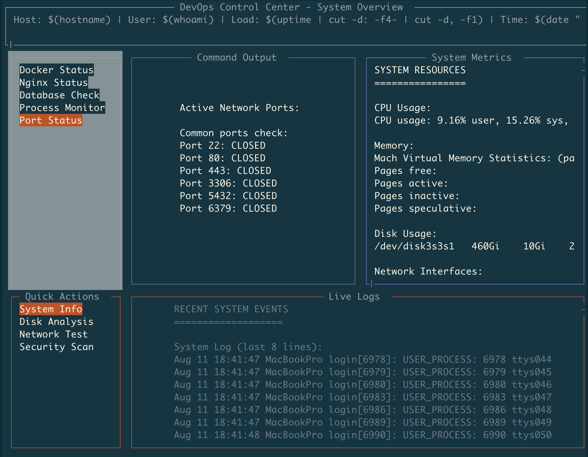

# BoxMux

**Automate tasks and put automation into terminal dashboards with minimal effort. Use YAML to transform Unix commands into interactive programs running in organized, threaded interfaces.**

[](https://opensource.org/licenses/MIT)
[](https://crates.io/crates/boxmux)
[](https://crates.io/crates/boxmux)
[](https://docs.rs/boxmux)





## What is BoxMux?

BoxMux lets you automate tasks and immediately visualize that automation in terminal interfaces. Define shell commands and scripts in YAML configuration to create monitoring dashboards, system administration tools, and interactive applications. Commands execute in separate threads with clean process management and real-time output display.

### Key Features

- Unix Command Integration: Transform shell commands into dashboard panels
- Multi-threaded Execution: Each command runs in isolated threads
- YAML Configuration: Define command pipelines and layouts declaratively
- Real-time Updates: Configurable refresh intervals for command execution
- Interactive Elements: Navigate between commands and control execution
- Socket Communication: External control and data injection via Unix sockets
- Variable System: Hierarchical variable substitution with YAML-defined variables, environment inheritance, and template support
- Configuration Validation: JSON Schema validation with detailed error reporting
- Enhanced Scrolling: Scroll position preservation and page navigation
- Plugin System: Dynamic component loading with security validation
- Enhanced Charting: Unicode-based charts (bar, line, histogram)
- Data Visualization: Table panels with CSV/JSON parsing, sorting, filtering, pagination
- Process Management: Clean handling of long-running and periodic commands
- Layout System: Organize command outputs in structured layouts
- Cross-platform: Works with standard Unix tooling

## Use Cases

- System Monitoring: Combine `top`, `df`, `iostat` into unified dashboards
- DevOps Tools: Orchestrate deployment scripts with real-time feedback
- Log Analysis: Run `tail`, `grep`, `awk` commands with structured output
- Network Monitoring: Execute `netstat`, `ss`, `ping` with visual organization
- Database Operations: Run queries and maintenance scripts with progress tracking
- Development Workflows: Combine build, test, and deployment commands

## Quick Start

### Prerequisites

- Rust (latest stable version) - [Install Rust](https://rustup.rs/)
- Shell access (bash/zsh) for script execution
- Optional: `gnuplot` for charting features

### Installation

#### Option 1: Install from Crates.io (Recommended)

Install BoxMux directly from the Rust package registry:

```bash
cargo install boxmux
```

Then run it with any YAML configuration:

```bash
boxmux layouts/dashboard.yaml
```

#### Option 2: Build from Source

1. Clone the repository

   ```bash
   git clone https://github.com/jowharshamshiri/boxmux.git
   cd boxmux
   ```

2. Build BoxMux

   ```bash
   cargo build --release
   ```

3. Run the example dashboard

   ```bash
   ./run_boxmux.sh layouts/dashboard.yaml
   ```

### Your First Interface

Create a simple interface with a single panel:

```yaml
# my-interface.yaml
app:
  layouts:
    - id: 'main'
      root: true
      title: 'My First Interface'
      bg_color: 'black'
      children:
        - id: 'welcome'
          title: 'Welcome Panel'
          position:
            x1: 10%
            y1: 20%
            x2: 90%
            y2: 80%
          content: 'Hello, BoxMux!'
          border: true
```

Run it:

```bash
# If installed via cargo install
boxmux my-interface.yaml

# If built from source
./run_boxmux.sh my-interface.yaml
```

## Documentation

### Core Concepts

- [Getting Started](docs/getting-started.md) - Step-by-step guide to your first interface
- [Configuration Reference](docs/configuration.md) - YAML configuration guide
- [Examples](docs/examples.md) - Real-world examples and use cases
- [API Reference](docs/api.md) - Socket messaging and programmatic control

### Topics

- [Layouts & Positioning](docs/layouts.md) - Creating layouts
- [Scripting & Automation](docs/scripting.md) - Integrating shell scripts
- [Themes & Styling](docs/themes.md) - Customizing appearance
- [Performance & Optimization](docs/performance.md) - Best practices

## Interface Components

### Panels

- Content Panels: Display static or dynamic text
- Interactive Menus: Navigate and select options
- Chart Panels: Unicode-based visualizations (bar, line, histogram)
- Table Panels: Structured data with sorting, filtering, pagination
- Plugin Panels: Dynamic components with security validation
- Log Panels: Monitor log files and streams
- Input Panels: Handle user input and commands

### Features

- Tab Navigation: Move between interactive elements
- Keyboard Shortcuts: Custom keybindings and actions
- Real-time Updates: Automatic refresh intervals
- Scrolling: Handle large content with scroll support
- Borders & Styling: Customize appearance
- Color Themes: Color customization

## Configuration Structure

BoxMux uses a hierarchical YAML structure:

```yaml
app:
  libs:                    # External script libraries
    - lib/utils.sh
  layouts:                 # Layout definitions
    - id: 'dashboard'
      root: true
      title: 'Dashboard'
      children:              # Nested panels
        - id: 'header'
          title: 'Header'
          position:          # Percentage-based positioning
            x1: 0%
            y1: 0%
            x2: 100%
            y2: 10%
          content: 'Welcome'
        - id: 'menu'
          title: 'Menu'
          choices:           # Interactive menu items
            - id: 'option1'
              content: 'Option 1'
              script:
                - echo 'Selected option 1'
```

## Variable System

BoxMux includes hierarchical variable substitution for dynamic configuration and template-driven interfaces:

### Variable Precedence

Variables are resolved in this order (highest to lowest priority):
1. **Panel-specific variables** (most granular control)
2. **Parent panel variables** (inherited through hierarchy)
3. **Layout-level variables** (layout scope)
4. **Application-global variables** (app-wide scope)
5. **Environment variables** (system fallback)
6. **Default values** (built-in fallbacks)

### Variable Syntax

```yaml
app:
  variables:
    SERVER_NAME: "production-server"
    DEFAULT_USER: "admin"
    
  layouts:
    - id: 'dashboard'
      title: 'Dashboard for ${SERVER_NAME}'
      children:
        - id: 'status_panel'
          variables:
            PANEL_TITLE: "Server Status"
          title: '${PANEL_TITLE}'
          content: 'Monitoring: ${SERVER_NAME}'
          script:
            - echo "Checking ${SERVER_NAME} status..."
            - ssh ${USER:${DEFAULT_USER}}@${SERVER_NAME} 'uptime'
```

### Variable Features

- Hierarchical inheritance: Child panels inherit parent variables
- Environment integration: Use existing environment variables as fallbacks
- Default values: Provide fallbacks with `${VAR:default_value}` syntax
- Multi-level substitution: Variables work in all fields (titles, content, scripts)
- Template configurations: Create reusable configurations with variable placeholders

### Real-world Example

```yaml
app:
  variables:
    ENVIRONMENT: "staging"
    LOG_LEVEL: "info"
    
  layouts:
    - id: 'monitoring'
      title: 'Monitoring Dashboard - ${ENVIRONMENT}'
      children:
        - id: 'app_logs'
          variables:
            SERVICE_NAME: "web-api"
          title: '${SERVICE_NAME} Logs'
          script:
            - tail -f /var/log/${SERVICE_NAME}/${ENVIRONMENT}.log
            
        - id: 'db_status'
          variables:
            SERVICE_NAME: "database"
          title: '${SERVICE_NAME} Status'
          script:
            - echo "Checking ${SERVICE_NAME} on ${ENVIRONMENT}..."
            - pg_isready -h ${DB_HOST:localhost} -p ${DB_PORT:5432}
```

This enables:
- Environment-specific configurations without code duplication
- Template-driven interfaces that adapt to different contexts
- Maintainable configurations with centralized variable management
- Flexible deployment across different environments and systems

## Socket Integration

BoxMux supports real-time communication via Unix sockets:

```bash
# Update panel content
echo '{"UpdatePanel": {"panel_id": "status", "content": "Connected"}}' | nc -U /tmp/boxmux.sock

# Send commands
echo '{"Command": {"action": "refresh", "panel_id": "logs"}}' | nc -U /tmp/boxmux.sock
```

## Example Gallery

### System Monitor

```yaml
# Real-time system monitoring dashboard
- id: 'cpu_chart'
  title: 'CPU Usage'
  refresh_interval: 1000
  script:
    - top -l 1 | grep "CPU usage" | awk '{print $3}' | sed 's/%//'
```

### Interactive Menu

```yaml
# Navigation menu with actions
- id: 'main_menu'
  title: 'Actions'
  tab_order: 1
  choices:
    - id: 'deploy'
      content: 'Deploy Application'
      script:
        - ./deploy.sh
    - id: 'logs'
      content: 'View Logs'
      script:
        - tail -f /var/log/app.log
```

### Variable Substitution

```yaml
# Template with environment variables
app:
  variables:
    APP_NAME: "My Application"
  layouts:
    - id: 'main'
      title: '${APP_NAME} Dashboard'
      children:
        - id: 'info'
          title: 'System Info'
          script:
            - echo "User: ${USER:unknown}"
            - echo "Home: $HOME"
            - echo "App: ${APP_NAME}"
```

### Data Visualization

```yaml
# Unicode-based chart
- id: 'metrics_chart'
  title: 'Performance Metrics'
  chart_config:
    chart_type: 'line'
    width: 40
    height: 10
  chart_data: |
    1,10
    2,15
    3,8
    4,20

# Table with sorting and filtering
- id: 'data_table'
  title: 'System Data'
  table_config:
    headers: ['Process', 'CPU', 'Memory']
    sortable: true
    filterable: true
    page_size: 10
  table_data: |
    nginx,2.5,45MB
    mysql,15.2,312MB
    redis,0.8,28MB
```

## Development

### Building from Source

```bash
# Debug build
cargo build

# Release build
cargo build --release

# Run tests
cargo test

# Run with specific layout
cargo run -- layouts/dashboard.yaml

# Or if installed via cargo install
boxmux layouts/dashboard.yaml
```

### Project Structure

```
boxmux/
├── src/
│   ├── main.rs              # Application entry point
│   ├── lib.rs               # Library exports
│   ├── draw_utils.rs        # Rendering utilities
│   ├── thread_manager.rs    # Thread management
│   └── model/               # Data structures
├── layouts/                 # Example configurations
├── docs/                    # Documentation
└── examples/               # Example interfaces
```

## Contributing

Contributions welcome. Please read our [Contributing Guidelines](CONTRIBUTING.md) for details.

### Development Setup

1. Fork the repository
2. Create a feature branch: `git checkout -b feature/amazing-feature`
3. Make your changes
4. Add tests for new functionality
5. Run tests: `cargo test`
6. Commit your changes: `git commit -m 'Add amazing feature'`
7. Push to the branch: `git push origin feature/amazing-feature`
8. Open a Pull Request

## Performance

BoxMux performance characteristics:

- Low Memory: Minimal memory footprint
- Fast Rendering: Optimized screen updates
- Efficient Threading: Multi-threaded architecture
- Responsive: Sub-millisecond input handling

## Troubleshooting

### Common Issues

**Installation Problems**

- Ensure Rust is installed: `rustc --version`
- Update Rust: `rustup update`

**Runtime Issues**

- Check YAML syntax with `yamllint`
- Verify script permissions
- Check terminal compatibility

**Performance Issues**

- Reduce refresh intervals
- Optimize scripts
- Monitor memory usage

For more help, see our [Troubleshooting Guide](docs/troubleshooting.md).

## License

This project is licensed under the MIT License - see the [LICENSE](LICENSE) file for details.

## Layouts Showcase


---
