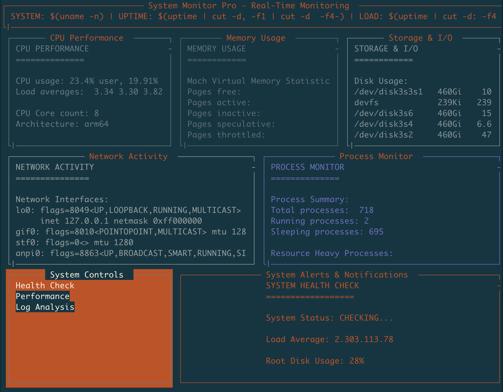

# BoxMux 📦

**A YAML-driven terminal UI framework for creating rich, interactive CLI applications and dashboards.**

[](https://opensource.org/licenses/MIT)
[](https://www.rust-lang.org/)
[](https://github.com/jowharshamshiri/boxmux)




## ✨ What is BoxMux?

BoxMux is a declarative framework for building terminal user interfaces using simple YAML configuration files. Whether you're creating system monitoring dashboards, interactive CLI tools, or complex terminal applications, BoxMux provides an intuitive way to design and deploy rich interfaces without writing complex UI code.

### 🚀 Key Features

- **📝 YAML-Driven**: Define your entire interface using simple, readable YAML configuration
- **🎨 Rich UI Components**: Panels, menus, charts, logs, and interactive elements
- **⚡ Real-time Updates**: Built-in refresh intervals and live data streaming
- **🎛️ Interactive**: Keyboard navigation, menu selection, and custom keybindings
- **🔌 Socket Integration**: Real-time communication via Unix sockets
- **📊 Data Visualization**: Support for charts, graphs, and custom visualizations
- **🎯 Flexible Layouts**: Percentage-based positioning and nested components
- **🌈 Customizable**: Full control over colors, borders, and styling
- **🔄 Script Integration**: Execute shell scripts and display output in panels
- **📱 Cross-platform**: Works on macOS, Linux, and other Unix-like systems

## 🎯 Use Cases

- **System Monitoring**: Create real-time dashboards for CPU, memory, disk usage
- **DevOps Tools**: Build deployment interfaces and log monitoring systems
- **CLI Applications**: Develop interactive command-line tools with rich interfaces
- **Data Visualization**: Display metrics, charts, and live data streams
- **Administrative Interfaces**: Build tools for system administration and management
- **Development Tools**: Create debugging interfaces and development dashboards

## 🚀 Quick Start

### Prerequisites

- **Rust** (latest stable version) - [Install Rust](https://rustup.rs/)
- **Shell access** (bash/zsh) for script execution
- **Optional**: `gnuplot` for charting features

### Installation

1. **Clone the repository**

   ```bash
   git clone https://github.com/jowharshamshiri/boxmux.git
   cd boxmux
   ```

2. **Build BoxMux**

   ```bash
   cargo build --release
   ```

3. **Run the example dashboard**

   ```bash
   ./run_boxmux.sh layouts/dashboard.yaml
   ```

### Your First Interface

Create a simple interface with a single panel:

```yaml
# my-interface.yaml
app:
  layouts:
    - id: 'main'
      root: true
      title: 'My First Interface'
      bg_color: 'black'
      children:
        - id: 'welcome'
          title: 'Welcome Panel'
          position:
            x1: 10%
            y1: 20%
            x2: 90%
            y2: 80%
          content: 'Hello, BoxMux!'
          border: true
```

Run it:

```bash
./run_boxmux.sh my-interface.yaml
```

## 📚 Documentation

### 📖 Core Concepts

- **[Getting Started](docs/getting-started.md)** - Step-by-step guide to your first interface
- **[Configuration Reference](docs/configuration.md)** - YAML configuration guide
- **[Examples](docs/examples.md)** - Real-world examples and use cases
- **[API Reference](docs/api.md)** - Socket messaging and programmatic control

### 🔧 Topics

- **[Layouts & Positioning](docs/layouts.md)** - Creating complex layouts
- **[Scripting & Automation](docs/scripting.md)** - Integrating shell scripts
- **[Themes & Styling](docs/themes.md)** - Customizing appearance
- **[Performance & Optimization](docs/performance.md)** - Best practices

## 🎨 Interface Components

### Panels

- **Content Panels**: Display static or dynamic text
- **Interactive Menus**: Navigate and select options
- **Chart Panels**: Visualize data with ASCII charts
- **Log Panels**: Monitor log files and streams
- **Input Panels**: Handle user input and commands

### Features

- **Tab Navigation**: Move between interactive elements
- **Keyboard Shortcuts**: Custom keybindings and actions
- **Real-time Updates**: Automatic refresh intervals
- **Scrolling**: Handle large content with scroll support
- **Borders & Styling**: Customize appearance
- **Color Themes**: Full color customization

## 🏗️ Configuration Structure

BoxMux uses a hierarchical YAML structure:

```yaml
app:
  libs:                    # External script libraries
    - lib/utils.sh
  layouts:                 # Layout definitions
    - id: 'dashboard'
      root: true
      title: 'Dashboard'
      children:              # Nested panels
        - id: 'header'
          title: 'Header'
          position:          # Percentage-based positioning
            x1: 0%
            y1: 0%
            x2: 100%
            y2: 10%
          content: 'Welcome'
        - id: 'menu'
          title: 'Menu'
          choices:           # Interactive menu items
            - id: 'option1'
              content: 'Option 1'
              script:
                - echo 'Selected option 1'
```

## 🔌 Socket Integration

BoxMux supports real-time communication via Unix sockets:

```bash
# Update panel content
echo '{"UpdatePanel": {"panel_id": "status", "content": "Connected"}}' | nc -U /tmp/boxmux.sock

# Send commands
echo '{"Command": {"action": "refresh", "panel_id": "logs"}}' | nc -U /tmp/boxmux.sock
```

## 🎯 Example Gallery

### System Monitor

```yaml
# Real-time system monitoring dashboard
- id: 'cpu_chart'
  title: 'CPU Usage'
  refresh_interval: 1000
  script:
    - top -l 1 | grep "CPU usage" | awk '{print $3}' | sed 's/%//'
```

### Interactive Menu

```yaml
# Navigation menu with actions
- id: 'main_menu'
  title: 'Actions'
  tab_order: 1
  choices:
    - id: 'deploy'
      content: 'Deploy Application'
      script:
        - ./deploy.sh
    - id: 'logs'
      content: 'View Logs'
      script:
        - tail -f /var/log/app.log
```

### Data Visualization

```yaml
# Chart with live data
- id: 'metrics_chart'
  title: 'Performance Metrics'
  refresh_interval: 5000
  script:
    - gnuplot -e "set terminal dumb; plot '/tmp/metrics.dat' with lines"
```

## 🛠️ Development

### Building from Source

```bash
# Debug build
cargo build

# Release build
cargo build --release

# Run tests
cargo test

# Run with specific layout
cargo run -- layouts/dashboard.yaml
```

### Project Structure

```
boxmux/
├── src/
│   ├── main.rs              # Application entry point
│   ├── lib.rs               # Library exports
│   ├── draw_utils.rs        # Rendering utilities
│   ├── thread_manager.rs    # Thread management
│   └── model/               # Data structures
├── layouts/                 # Example configurations
├── docs/                    # Documentation
└── examples/               # Example interfaces
```

## 🤝 Contributing

I welcome contributions! Please read our [Contributing Guidelines](CONTRIBUTING.md) for details.

### Development Setup

1. Fork the repository
2. Create a feature branch: `git checkout -b feature/amazing-feature`
3. Make your changes
4. Add tests for new functionality
5. Run tests: `cargo test`
6. Commit your changes: `git commit -m 'Add amazing feature'`
7. Push to the branch: `git push origin feature/amazing-feature`
8. Open a Pull Request

## 🗺️ Roadmap

### 🎯 Current Focus (v0.8)

- [ ] Enhanced charting capabilities
- [ ] Plugin system for custom components
- [ ] Configuration validation and error handling
- [ ] Performance optimizations
- [ ] Improved documentation and examples

### 🚀 Future Features (v1.0+)

- [ ] Mouse support
- [ ] graphics and rendering
- [ ] Network-based remote interfaces
- [ ] Configuration hot-reloading
- [ ] Built-in data sources and connectors
- [ ] Web-based configuration editor
- [ ] Package management system
- [ ] Multi-language scripting support

### 🔧 Technical Improvements

- [ ] Memory usage optimization
- [ ] Better error messages and debugging
- [ ] Configuration schema validation
- [ ] Automated testing framework
- [ ] Cross-platform compatibility testing
- [ ] Performance benchmarking

## 📊 Performance

BoxMux is designed for efficiency:

- **Low Memory**: Minimal memory footprint
- **Fast Rendering**: Optimized screen updates
- **Efficient Threading**: Multi-threaded architecture
- **Responsive**: Sub-millisecond input handling

## 🐛 Troubleshooting

### Common Issues

**Installation Problems**

- Ensure Rust is installed: `rustc --version`
- Update Rust: `rustup update`

**Runtime Issues**

- Check YAML syntax with `yamllint`
- Verify script permissions
- Check terminal compatibility

**Performance Issues**

- Reduce refresh intervals
- Optimize scripts
- Monitor memory usage

For more help, see our [Troubleshooting Guide](docs/troubleshooting.md).

## 📝 License

This project is licensed under the MIT License - see the [LICENSE](LICENSE) file for details.

## 🙏 Acknowledgments

- Built with [Rust](https://www.rust-lang.org/)
- Terminal handling via [Crossterm](https://github.com/crossterm-rs/crossterm)
- YAML parsing with [serde_yaml](https://github.com/dtolnay/serde-yaml)
- Inspired by tmux, screen, and TUI frameworks

---

**Made with [Bahram Joharshamshiri](https://github.com/jowharshamshiri)**
